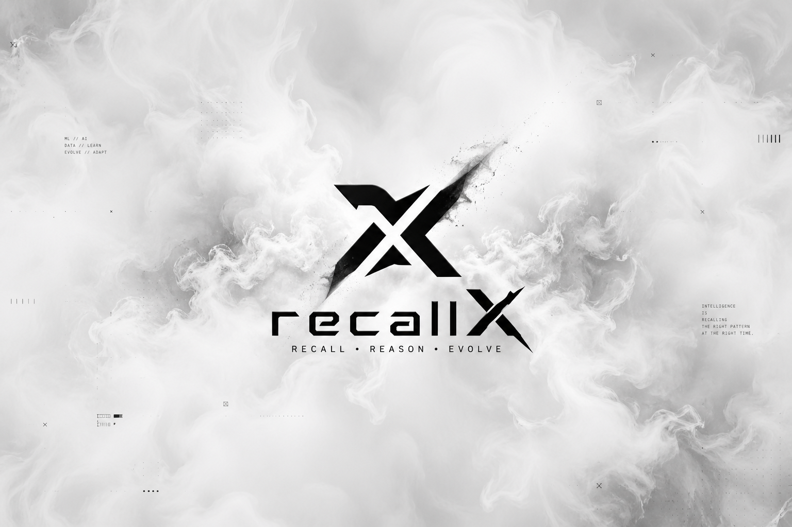

# 🧠 RecallX

RecallX is a personal knowledge memory system inspired by tools like Mem0.
It helps store, organize, and retrieve contextual information efficiently using modern backend technologies.



## 🚀 Overview

RecallX is designed to act as a long-term memory layer for applications.
It combines multiple databases and services to enable:

- Semantic search (vector database)
- Graph-based relationships
- Fast caching
- Persistent storage

## ⚙️ Tech Stack

- **FastAPI** – Backend API
- **PostgreSQL** – Structured data storage
- **Qdrant** – Vector database for embeddings
- **Neo4j** – Graph relationships
- **Redis** – Caching layer
- **Docker** – Containerized setup

## 🏗️ Architecture (High-Level)

- User input → processed & stored
- Embeddings → stored in Qdrant
- Relationships → stored in Neo4j
- Metadata → stored in PostgreSQL
- Frequently accessed data → cached in Redis

## 🐳 Running Locally

```bash
docker compose up --build
```

App will be available at:

```
http://localhost:8000
```

## 📂 Project Structure

```
app/
  ├── core/        # Config & settings
  ├── db/          # DB connections & checks
  ├── api/         # Routes
  └── main.py      # Entry point
```

## 🔄 Current Status

🚧 Work in progress — core infrastructure setup is underway.

## 🎯 Goal

To build a scalable and modular memory system that can be integrated into AI applications for better context retention.

---

> This project is under active development. More features and documentation coming soon.
